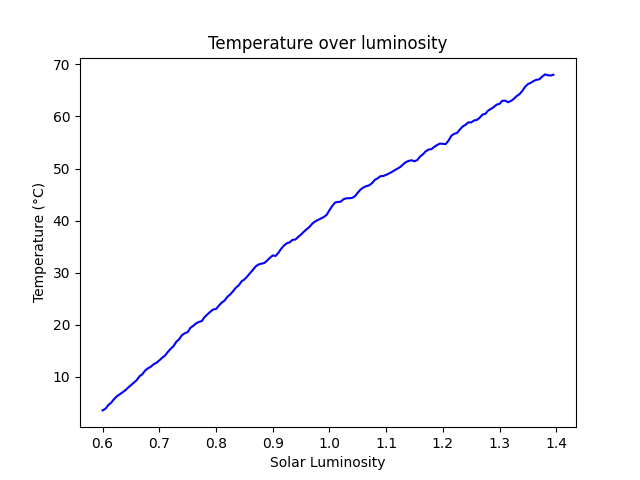

This project includes two Daisyworlds one I recreated, and the other I have attempted to extend using the resources available to me.

Daisyworld.py and point.py is the extension and simple_daisyworld is the recreation. In the main.py file you can see:

    # simple_main(0.25, 0.75)
    # simple_main(0.4, 0.6)
    # simple_main(0.25, 0.75, death_type="plague")
    # simple_main(0.25, 0.75, growth_rate="high")
    # simple_main(0.25, 0.75, growth_rate="low")
    enhanced_main()

I have just commented the simple_main functions out to stop them from running, it is kept there to rerun in case the user would like to view the results.

enhanced_main is my most recent attempt at recreating Daisyworld, but I have miserably failed in doing so. I am not sure where have I gone wrong however I believe it may be to do with how I implemented the code for breeding sexually and asexually.

The issue I have is the temperature continually rising although there are daisies to control the temperature.

UPDATE: Extended model is not entirely broken?
Also note that the stated red daisies are actually grey

This looks an awful lot like the graph from classic Daisyworld, but I may also be wrong

